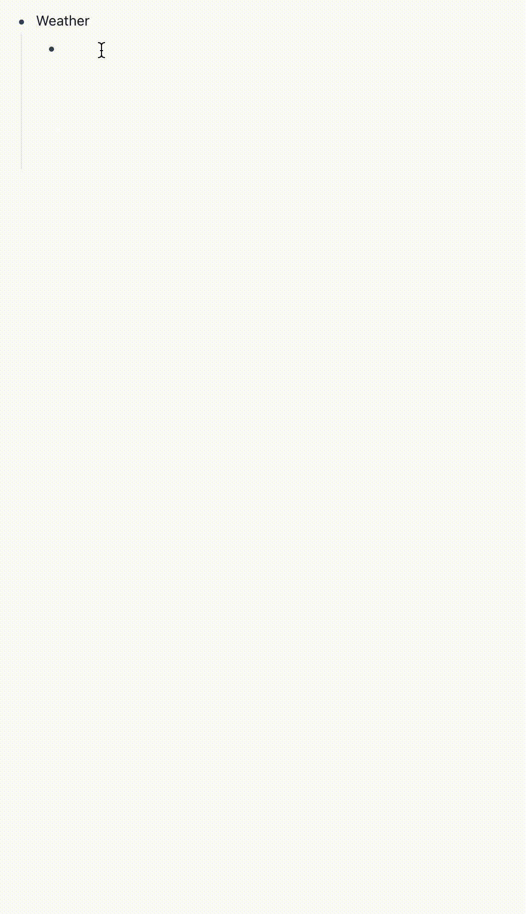
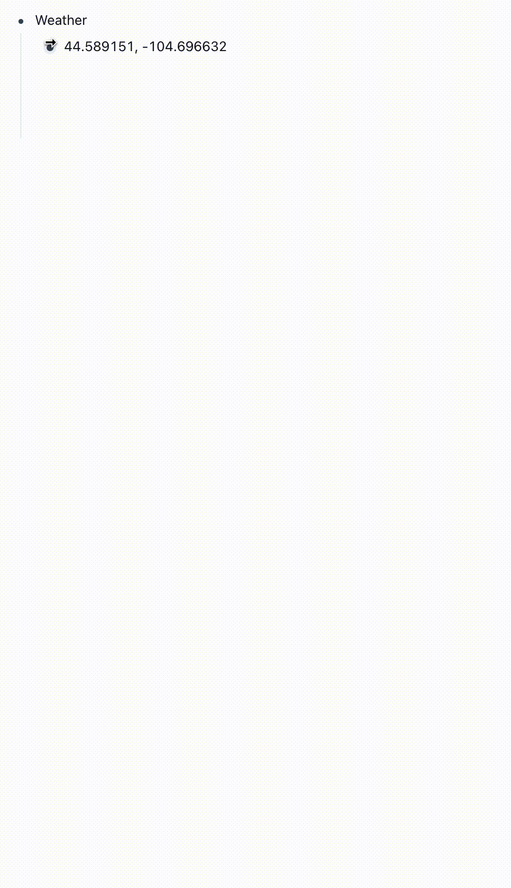

# Logseq Weather Plugin

https://gitlab.com/axelav/logseq-plugin-weather

Query [openweathermap.org](https://openweathermap.org) API for weather data and write it to your logseq graph

## Features

Writes current weather data for:

- forecast
- temperature
- humidity
- wind speed
- sunrise / sunset
- moonrise / moonset
- location

## Usage

### Add default local coordinates in plugin settings

Must be in the format 'latitude, longitude', eg. `28.580573, -81.351803`

### Add current local weather data to graph

- Create an empty block.
- Select "Add current weather data" from the block's context menu (right-click the block bullet).

### Add current weather data for a specific location

- Add latitude and longitude coordinates to a block, eg: "44.589151, -104.696632". Coordinates must be formatted as `<latitude>, <longitude>`.
- Select "Add current weather data" from the block's context menu (right-click the block bullet).

### Settings

Other settings include preferring metric units over imperial and excluding various fields (location, sun, moon, wind, and humidity) from the output.

