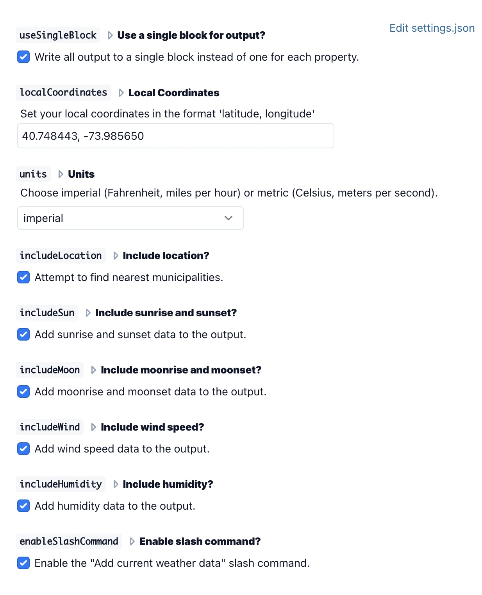

# Logseq Weather Plugin

https://github.com/axelav/logseq-plugin-weather

Query [openweathermap.org](https://openweathermap.org) API for weather data and
write it to your logseq graph using a slash command, context menu, or renderer
macro.

## Features

Writes current weather data for:

- forecast
- temperature
- humidity
- wind speed
- sunrise / sunset
- moonrise / moonset
- location


## Usage

### Add current weather data using default local coordinates

- Open the plugin settings and enter the location you'd like to use as a default.
  Must be in the format 'latitude, longitude', eg. `28.580573, -81.351803`
- Create an empty block.
- Use the "Add current weather data" slash command or select "Add current
  weather data" from the block's context menu (right-click the block bullet).
- Alternately, use the `{{renderer :addCurrentWeatherData}}` macro in a
  template. For example:

  ```
  - template:: weather
  template-including-parent:: false
    - 44.590959, -104.698514
    {{renderer :addCurrentWeatherData}}
  ```


### Add current weather data for a specific location

- Add latitude and longitude coordinates to a block, eg: "44.589151,
  -104.696632". Coordinates must be formatted as `<latitude>, <longitude>`.
- Use the "Add current weather data" slash command or select "Add current
  weather data" from the block's context menu (right-click the block bullet).


### Settings

Other settings include preferring metric units over imperial and excluding
various fields (location, sun, moon, wind, and humidity) from the output.


